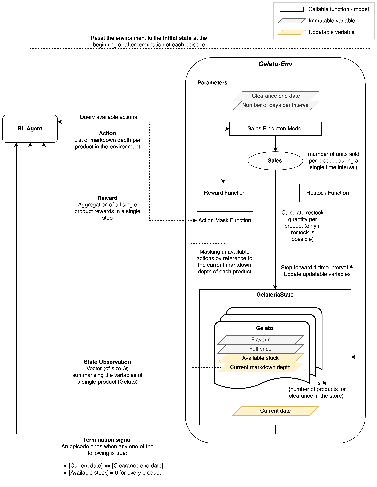

# Gelato-Env

Gelato-Env is an RL environment modelling a single Gelateria that sells multiple flavours of ice cream. 
However, it can also be interpreted generically as a single store that sells multiple products.

The environment is based on the [OpenAI Gym](https://www.gymlibrary.dev/) framework, with additional features to support the modelling the price markdowns of a retail store.

## Design
The design of the Gelato-Env environment is shown in the following diagram:


## Sales Prediction Model
A pre-trained sales prediction model is needed to make use of the environment. The environment comes with a two-step sales prediction model that predicts the sales of each flavour of ice cream with the multiplication of the separately predicted base sales and sale uplift. That is, the sales are predicted using the outputs of two separate prediction models, one for base sales and the other for the sale uplifts. The sales are predicted as:

$$\text{sales} = \text{base sales} \times \text{sale uplift}$$

No pre-trained model is provided, but a training script is provided for training the base sales model using a user-provided dataset. For simplicity, the default base sales model is a simple MLP with configurable hidden layers. As provided in the code, the default sale uplift model simply samples sales uplifts from a probability distribution.

In case the user wants to use a different sales prediction model, the user can implement their own sales prediction model and pass it to the environment by changing the `build_env` method in `experiments/experiment.py`.


[//]: # (### Training the Sales Prediction Model)

[//]: # (The environment comes with a default two-step model that predicts the sales of each flavour of ice cream with the multiplication of the separately predicted base sales and sale uplift. That is, the sales is predicted as:)

[//]: # ($$\text{sales} = \text{base_sales} \times \text{sale uplift} $$.)

[//]: # ()
[//]: # (The training script provides a simple sales prediction model using a fairly simple MLP.)

[//]: # (```python)

[//]: # (python train_sales_prediction_model.py)

[//]: # (```)


## Logging
This environment has integration with [wandb](https://docs.wandb.ai) to log the training process, so the user will need to set up a wandb account and enter their `WANDB_API_KEY` when prompted.
It is possible to turn off the wandb logging in the configuration, but the progress of training will only be visible in the console.

[//]: # (## Installation)

## Implemented Algorithms

[//]: # (* TD-Zero)

[//]: # (* MC-Control)
* Double Deep Q-Network (DDQN)
* Soft Actor-Critic for Discrete Action Spaces (SAC-Discrete)
* Model-Based Policy Optimization (MBPO) with DDQN as actor
* Model-Based Policy Optimization (MBPO) with SAC-Discrete as actor

## Configuration
All configurable parameters are kept in either `utils/config.py` or `experiments/experiment.py`. The user can change the parameters in this file to change the behaviour of the environment and the training process.

[//]: # (### Linux)

[//]: # ()
[//]: # (It is convenient to make use of `pipx` to install general helper packages:)

[//]: # ()
[//]: # (```bash)

[//]: # (python -m venv $HOME/.venvs)

[//]: # (source $HOME/.venvs/bin/activate)

[//]: # (pip install pipx)

[//]: # (pipx install black)

[//]: # (pipx install isort)

[//]: # (pipx install ruff)

[//]: # (pipx install pre-commit)

[//]: # (```)

[//]: # ()
[//]: # (Use the Makefile to install the repo and its dependencies:)

[//]: # ()
[//]: # (```bash)

[//]: # (make setup)

[//]: # (```)

[//]: # ()
[//]: # (#)
